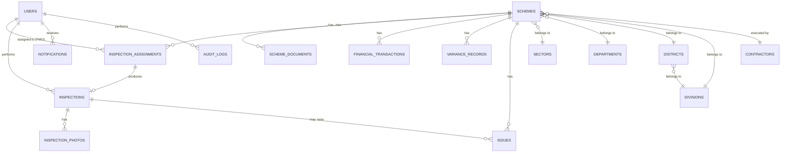

# MongoDB Database Schema — Smart Provincial M&E Management Ecosystem

**Stack:** MongoDB · Express.js · React Native · Node.js (MERN)
**ODM:** Mongoose (recommended)
**Scope:** SIMS · PMS · Finance Dashboard · Variance Engine

---

## 1. Overview

This document defines the MongoDB collection schemas for the Smart Provincial M&E Management Ecosystem. Each collection is presented with its purpose, field-level schema table, a Mongoose-style schema definition, recommended indexes, and its relationships to other collections.

### 1.1 Collection List

| # | Collection | Purpose |
|---|-----------|---------|
| 1 | `users` | System users and their role (P&D/MEC Central, Line Department Head, Regional Director, FMO) |
| 2 | `sectors` | Sector classification (Health, Education, Roads, Energy, etc.) |
| 3 | `departments` | Executing/owning department for a scheme |
| 4 | `divisions` | Administrative division |
| 5 | `districts` | Administrative district (belongs to a division) |
| 6 | `contractors` | Executing agencies / contractors |
| 7 | `schemes` | Central scheme/project record (SIMS core) |
| 8 | `schemeDocuments` | PC-I, approvals, drawings, and other scheme documents |
| 9 | `inspectionAssignments` | Dispatch record linking a scheme, an FMO, and a deadline |
| 10 | `inspections` | A completed/in-progress field inspection |
| 11 | `inspectionPhotos` | Watermarked evidence photographs |
| 12 | `issues` | Structured issue/observation reports |
| 13 | `financialTransactions` | Allocation, release, and expenditure records |
| 14 | `varianceRecords` | Computed variance index/classification, time-series per scheme |
| 15 | `notifications` | System-generated notifications and alerts |
| 16 | `auditLogs` | Activity/audit trail across the system |

> **Note:** User **roles** are modeled as an enum field on `users` rather than a separate collection, since the system has a small, fixed set of four roles (Section 6 of the project proposal). If fine-grained, per-permission access control is introduced later, a dedicated `roles`/`permissions` collection can be added without disrupting this schema.

### 1.2 Entity Relationship Overview



---

## 2. Collection Schemas

### 2.1 `users`

**Purpose:** Stores all system users and their role, which drives role-based access control (RBAC) across the mobile application.

| Field | Type | Required | Description |
|---|---|---|---|
| `_id` | ObjectId | auto | Primary key |
| `name` | String | ✔ | Full name of the user |
| `email` | String | ✔ | Unique login email |
| `passwordHash` | String | ✔ | Bcrypt/argon2 hashed password |
| `role` | String (enum) | ✔ | `pd_mec_central` \| `line_department_head` \| `regional_director` \| `fmo` |
| `departmentId` | ObjectId (ref `departments`) | — | Applicable to `line_department_head` |
| `divisionId` | ObjectId (ref `divisions`) | — | Applicable to `regional_director` / `fmo` |
| `phone` | String | — | Contact number |
| `isActive` | Boolean | ✔ | Default `true`; used to deactivate accounts |
| `lastLoginAt` | Date | — | Updated on each successful login |
| `createdAt` / `updatedAt` | Date | auto | Mongoose timestamps |

```js
const userSchema = new Schema({
  name: { type: String, required: true },
  email: { type: String, required: true, unique: true, lowercase: true },
  passwordHash: { type: String, required: true },
  role: {
    type: String,
    required: true,
    enum: ["pd_mec_central", "line_department_head", "regional_director", "fmo"],
  },
  departmentId: { type: Schema.Types.ObjectId, ref: "Department" },
  divisionId: { type: Schema.Types.ObjectId, ref: "Division" },
  phone: String,
  isActive: { type: Boolean, default: true },
  lastLoginAt: Date,
}, { timestamps: true });

userSchema.index({ email: 1 }, { unique: true });
userSchema.index({ role: 1 });
```

**Indexes:** `email` (unique) · `role`

---

### 2.2 `sectors`

**Purpose:** Sector classification of schemes (Health, Education, Roads & Bridges, Energy, Public Health Engineering, etc.).

| Field | Type | Required | Description |
|---|---|---|---|
| `_id` | ObjectId | auto | Primary key |
| `name` | String | ✔ | e.g., "Health", "Roads & Bridges" |
| `code` | String | — | Short code, e.g., `HLT`, `RDS` |
| `createdAt` | Date | auto | — |

```js
const sectorSchema = new Schema({
  name: { type: String, required: true, unique: true },
  code: String,
}, { timestamps: true });
```

**Indexes:** `name` (unique)

---

### 2.3 `departments`

**Purpose:** Owning/executing department for a scheme (e.g., Health Department, Works & Services Department).

| Field | Type | Required | Description |
|---|---|---|---|
| `_id` | ObjectId | auto | Primary key |
| `name` | String | ✔ | Department name |
| `code` | String | — | Short code |
| `sectorId` | ObjectId (ref `sectors`) | — | Primary associated sector |
| `createdAt` | Date | auto | — |

```js
const departmentSchema = new Schema({
  name: { type: String, required: true, unique: true },
  code: String,
  sectorId: { type: Schema.Types.ObjectId, ref: "Sector" },
}, { timestamps: true });
```

**Indexes:** `name` (unique) · `sectorId`

---

### 2.4 `divisions`

**Purpose:** Top-level administrative division (e.g., Hyderabad Division, Karachi Division).

| Field | Type | Required | Description |
|---|---|---|---|
| `_id` | ObjectId | auto | Primary key |
| `name` | String | ✔ | Division name |
| `code` | String | — | Short code |
| `createdAt` | Date | auto | — |

```js
const divisionSchema = new Schema({
  name: { type: String, required: true, unique: true },
  code: String,
}, { timestamps: true });
```

**Indexes:** `name` (unique)

---

### 2.5 `districts`

**Purpose:** District-level administrative classification, nested under a division.

| Field | Type | Required | Description |
|---|---|---|---|
| `_id` | ObjectId | auto | Primary key |
| `name` | String | ✔ | District name |
| `code` | String | — | Short code |
| `divisionId` | ObjectId (ref `divisions`) | ✔ | Parent division |
| `createdAt` | Date | auto | — |

```js
const districtSchema = new Schema({
  name: { type: String, required: true },
  code: String,
  divisionId: { type: Schema.Types.ObjectId, ref: "Division", required: true },
}, { timestamps: true });

districtSchema.index({ divisionId: 1 });
```

**Indexes:** `divisionId` · compound `{ name: 1, divisionId: 1 }` (unique)

---

### 2.6 `contractors`

**Purpose:** Executing agencies / contractors assigned to schemes.

| Field | Type | Required | Description |
|---|---|---|---|
| `_id` | ObjectId | auto | Primary key |
| `name` | String | ✔ | Contractor / firm name |
| `licenseNumber` | String | — | Registration/license number |
| `contactPerson` | String | — | Primary contact name |
| `phone` | String | — | Contact number |
| `email` | String | — | Contact email |
| `address` | String | — | Registered address |
| `createdAt` | Date | auto | — |

```js
const contractorSchema = new Schema({
  name: { type: String, required: true },
  licenseNumber: String,
  contactPerson: String,
  phone: String,
  email: String,
  address: String,
}, { timestamps: true });
```

**Indexes:** `name`

---

### 2.7 `schemes` — Central Scheme/Project Record (SIMS core)

**Purpose:** The authoritative, centralized record for every development scheme. Milestones are embedded (small, bounded, always read together with the scheme); documents, inspections, finance, and variance are referenced from their own collections.

| Field | Type | Required | Description |
|---|---|---|---|
| `_id` | ObjectId | auto | Primary key |
| `schemeId` | String | ✔ | Unique human-readable ID, e.g. `SCH-2026-00123` |
| `name` | String | ✔ | Scheme name |
| `sectorId` | ObjectId (ref `sectors`) | ✔ | — |
| `departmentId` | ObjectId (ref `departments`) | ✔ | — |
| `districtId` | ObjectId (ref `districts`) | ✔ | — |
| `divisionId` | ObjectId (ref `divisions`) | ✔ | — |
| `cityArea` | String | — | City/area within the district |
| `executingAgency` | String | — | Name of executing agency (if not a registered contractor) |
| `contractorId` | ObjectId (ref `contractors`) | — | — |
| `supervisingEngineer` | Object | — | `{ name, designation, contact }` embedded |
| `approvedCost` | Number | ✔ | Approved budget (PKR) |
| `startDate` | Date | — | Actual/planned start date |
| `expectedCompletionDate` | Date | — | — |
| `currentStatus` | String (enum) | ✔ | `planned` \| `ongoing` \| `completed` \| `delayed` \| `halted` |
| `projectHealth` | String (enum) | ✔ | `satisfactory` \| `delayed` \| `halted_abandoned` |
| `location` | GeoJSON Point | ✔ | `{ type: "Point", coordinates: [lng, lat] }` |
| `boundary` | GeoJSON Polygon | — | Site boundary, if surveyed |
| `milestones` | Array\<Object\> | — | Embedded weighted milestone list (see below) |
| `physicalProgressPercent` | Number | ✔ | Cached, weighted; recalculated on each inspection |
| `financialProgressPercent` | Number | ✔ | Cached; recalculated on each financial transaction |
| `varianceIndex` | Number | — | Cached latest variance (financial % − physical %) |
| `varianceClassification` | String (enum) | — | `normal` \| `yellow` \| `red` |
| `createdBy` | ObjectId (ref `users`) | ✔ | — |
| `createdAt` / `updatedAt` | Date | auto | — |

**Embedded `milestones[]` sub-document:**

| Field | Type | Description |
|---|---|---|
| `milestoneId` | ObjectId | Unique ID within the array (used by inspections to reference this milestone) |
| `name` | String | e.g., "Earthwork", "Sub-base", "Structure" |
| `weightPercent` | Number | Contribution weight toward overall physical progress (weights across a scheme total 100) |
| `targetDate` | Date | Planned completion date for this milestone |
| `currentCompletionPercent` | Number | Latest recorded completion (0–100) |
| `lastUpdatedByInspectionId` | ObjectId (ref `inspections`) | Traceability to the inspection that last updated this milestone |
| `remarks` | String | Latest inspector remarks on this milestone |

```js
const milestoneSubSchema = new Schema({
  name: { type: String, required: true },
  weightPercent: { type: Number, required: true, min: 0, max: 100 },
  targetDate: Date,
  currentCompletionPercent: { type: Number, default: 0, min: 0, max: 100 },
  lastUpdatedByInspectionId: { type: Schema.Types.ObjectId, ref: "Inspection" },
  remarks: String,
}, { _id: true }); // _id serves as milestoneId

const schemeSchema = new Schema({
  schemeId: { type: String, required: true, unique: true },
  name: { type: String, required: true },
  sectorId: { type: Schema.Types.ObjectId, ref: "Sector", required: true },
  departmentId: { type: Schema.Types.ObjectId, ref: "Department", required: true },
  districtId: { type: Schema.Types.ObjectId, ref: "District", required: true },
  divisionId: { type: Schema.Types.ObjectId, ref: "Division", required: true },
  cityArea: String,
  executingAgency: String,
  contractorId: { type: Schema.Types.ObjectId, ref: "Contractor" },
  supervisingEngineer: {
    name: String,
    designation: String,
    contact: String,
  },
  approvedCost: { type: Number, required: true },
  startDate: Date,
  expectedCompletionDate: Date,
  currentStatus: {
    type: String,
    required: true,
    enum: ["planned", "ongoing", "completed", "delayed", "halted"],
    default: "planned",
  },
  projectHealth: {
    type: String,
    enum: ["satisfactory", "delayed", "halted_abandoned"],
    default: "satisfactory",
  },
  location: {
    type: { type: String, enum: ["Point"], default: "Point" },
    coordinates: { type: [Number], required: true }, // [lng, lat]
  },
  boundary: {
    type: { type: String, enum: ["Polygon"] },
    coordinates: [[[Number]]],
  },
  milestones: [milestoneSubSchema],
  physicalProgressPercent: { type: Number, default: 0 },
  financialProgressPercent: { type: Number, default: 0 },
  varianceIndex: Number,
  varianceClassification: { type: String, enum: ["normal", "yellow", "red"] },
  createdBy: { type: Schema.Types.ObjectId, ref: "User", required: true },
}, { timestamps: true });

schemeSchema.index({ schemeId: 1 }, { unique: true });
schemeSchema.index({ location: "2dsphere" });
schemeSchema.index({ boundary: "2dsphere" });
schemeSchema.index({ sectorId: 1, districtId: 1, divisionId: 1, currentStatus: 1 });
schemeSchema.index({ varianceClassification: 1 });
```

**Indexes:** `schemeId` (unique) · `location` (2dsphere — powers geofence distance queries and the GIS map) · `boundary` (2dsphere) · compound `{ sectorId, districtId, divisionId, currentStatus }` (dashboard filtering) · `varianceClassification` (red-flag queries)

---

### 2.8 `schemeDocuments`

**Purpose:** PC-I, administrative approvals, technical sanctions, drawings, and revision documents. Kept as a separate, referenced collection (not embedded) since the number of documents per scheme is unbounded and grows over time.

| Field | Type | Required | Description |
|---|---|---|---|
| `_id` | ObjectId | auto | Primary key |
| `schemeId` | ObjectId (ref `schemes`) | ✔ | — |
| `documentType` | String (enum) | ✔ | `pc1` \| `administrative_approval` \| `technical_sanction` \| `engineering_drawing` \| `revised_timeline` \| `revision_request` \| `other` |
| `title` | String | — | Display title |
| `fileUrl` | String | ✔ | Object storage URL/key |
| `fileType` | String | — | MIME type |
| `version` | Number | ✔ | Default `1`; incremented on revision |
| `uploadedBy` | ObjectId (ref `users`) | ✔ | — |
| `uploadedAt` | Date | ✔ | — |

```js
const schemeDocumentSchema = new Schema({
  schemeId: { type: Schema.Types.ObjectId, ref: "Scheme", required: true },
  documentType: {
    type: String,
    required: true,
    enum: ["pc1", "administrative_approval", "technical_sanction",
           "engineering_drawing", "revised_timeline", "revision_request", "other"],
  },
  title: String,
  fileUrl: { type: String, required: true },
  fileType: String,
  version: { type: Number, default: 1 },
  uploadedBy: { type: Schema.Types.ObjectId, ref: "User", required: true },
  uploadedAt: { type: Date, default: Date.now },
}, { timestamps: true });

schemeDocumentSchema.index({ schemeId: 1, documentType: 1 });
```

**Indexes:** compound `{ schemeId, documentType }`

---

### 2.9 `inspectionAssignments`

**Purpose:** Dispatch record created by a Regional/Divisional Director, linking a scheme to an FMO with a deadline.

| Field | Type | Required | Description |
|---|---|---|---|
| `_id` | ObjectId | auto | Primary key |
| `schemeId` | ObjectId (ref `schemes`) | ✔ | — |
| `assignedTo` | ObjectId (ref `users`) | ✔ | FMO |
| `assignedBy` | ObjectId (ref `users`) | ✔ | Regional/Divisional Director |
| `deadline` | Date | ✔ | — |
| `status` | String (enum) | ✔ | `assigned` \| `en_route` \| `inspected` \| `report_submitted` \| `reviewed` |
| `priority` | String (enum) | — | `normal` \| `high` \| `urgent` |
| `notes` | String | — | Dispatch instructions |
| `createdAt` / `updatedAt` | Date | auto | — |

```js
const inspectionAssignmentSchema = new Schema({
  schemeId: { type: Schema.Types.ObjectId, ref: "Scheme", required: true },
  assignedTo: { type: Schema.Types.ObjectId, ref: "User", required: true },
  assignedBy: { type: Schema.Types.ObjectId, ref: "User", required: true },
  deadline: { type: Date, required: true },
  status: {
    type: String,
    required: true,
    enum: ["assigned", "en_route", "inspected", "report_submitted", "reviewed"],
    default: "assigned",
  },
  priority: { type: String, enum: ["normal", "high", "urgent"], default: "normal" },
  notes: String,
}, { timestamps: true });

inspectionAssignmentSchema.index({ schemeId: 1 });
inspectionAssignmentSchema.index({ assignedTo: 1, status: 1 });
inspectionAssignmentSchema.index({ deadline: 1 });
```

**Indexes:** `schemeId` · compound `{ assignedTo, status }` (FMO "My Tasks" screen) · `deadline` (overdue notifications)

---

### 2.10 `inspections`

**Purpose:** A conducted field inspection, including GPS verification outcome and milestone progress updates. Represents the FMO's submitted report.

| Field | Type | Required | Description |
|---|---|---|---|
| `_id` | ObjectId | auto | Primary key |
| `assignmentId` | ObjectId (ref `inspectionAssignments`) | ✔ | — |
| `schemeId` | ObjectId (ref `schemes`) | ✔ | Denormalized for fast querying |
| `inspectorId` | ObjectId (ref `users`) | ✔ | FMO who conducted the inspection |
| `inspectionDate` | Date | ✔ | — |
| `gpsAtInspection` | GeoJSON Point | ✔ | FMO's live location at inspection time |
| `distanceFromSchemeMeters` | Number | ✔ | Calculated distance to scheme's registered location |
| `geofencePassed` | Boolean | ✔ | Whether the officer was within the configured radius |
| `mockLocationSuspected` | Boolean | ✔ | Default `false`; flagged by anti-spoofing check |
| `milestoneUpdates` | Array\<Object\> | — | Embedded snapshot of milestone progress recorded this visit (see below) |
| `overallPhysicalProgressPercent` | Number | ✔ | Weighted result computed at submission |
| `observations` | String | — | Free-text field notes |
| `recommendations` | String | — | Inspector recommendations |
| `resultingHealthClassification` | String (enum) | — | `satisfactory` \| `delayed` \| `halted_abandoned` |
| `submittedAt` | Date | ✔ | — |
| `syncedFromOffline` | Boolean | ✔ | Default `false` |
| `offlineCapturedAt` | Date | — | Original capture time if submitted via offline sync |

**Embedded `milestoneUpdates[]` sub-document** (snapshots `milestoneName`/`weightPercent` at time of inspection so historical reports remain accurate even if the scheme's milestone definitions change later):

| Field | Type | Description |
|---|---|---|
| `milestoneId` | ObjectId | References the milestone's `_id` within `schemes.milestones` |
| `milestoneName` | String | Snapshot of the milestone name at inspection time |
| `weightPercent` | Number | Snapshot of the milestone weight at inspection time |
| `completionPercent` | Number | Completion recorded during this inspection |
| `remarks` | String | Inspector remarks for this milestone |

```js
const milestoneUpdateSubSchema = new Schema({
  milestoneId: { type: Schema.Types.ObjectId, required: true },
  milestoneName: String,
  weightPercent: Number,
  completionPercent: { type: Number, min: 0, max: 100, required: true },
  remarks: String,
}, { _id: false });

const inspectionSchema = new Schema({
  assignmentId: { type: Schema.Types.ObjectId, ref: "InspectionAssignment", required: true },
  schemeId: { type: Schema.Types.ObjectId, ref: "Scheme", required: true },
  inspectorId: { type: Schema.Types.ObjectId, ref: "User", required: true },
  inspectionDate: { type: Date, required: true },
  gpsAtInspection: {
    type: { type: String, enum: ["Point"], default: "Point" },
    coordinates: { type: [Number], required: true },
  },
  distanceFromSchemeMeters: { type: Number, required: true },
  geofencePassed: { type: Boolean, required: true },
  mockLocationSuspected: { type: Boolean, default: false },
  milestoneUpdates: [milestoneUpdateSubSchema],
  overallPhysicalProgressPercent: { type: Number, required: true },
  observations: String,
  recommendations: String,
  resultingHealthClassification: {
    type: String,
    enum: ["satisfactory", "delayed", "halted_abandoned"],
  },
  submittedAt: { type: Date, required: true },
  syncedFromOffline: { type: Boolean, default: false },
  offlineCapturedAt: Date,
}, { timestamps: true });

inspectionSchema.index({ schemeId: 1, inspectionDate: -1 });
inspectionSchema.index({ inspectorId: 1 });
inspectionSchema.index({ assignmentId: 1 }, { unique: true });
inspectionSchema.index({ gpsAtInspection: "2dsphere" });
```

**Indexes:** compound `{ schemeId, inspectionDate: -1 }` (inspection history) · `inspectorId` · `assignmentId` (unique — one inspection per assignment) · `gpsAtInspection` (2dsphere)

---

### 2.11 `inspectionPhotos`

**Purpose:** Watermarked evidence photographs captured during an inspection. Kept as a separate, referenced collection since the count per inspection is unbounded.

| Field | Type | Required | Description |
|---|---|---|---|
| `_id` | ObjectId | auto | Primary key |
| `inspectionId` | ObjectId (ref `inspections`) | ✔ | — |
| `fileUrl` | String | ✔ | Object storage URL/key |
| `thumbnailUrl` | String | — | — |
| `capturedAt` | Date | ✔ | — |
| `gps` | GeoJSON Point | ✔ | Location at time of capture |
| `watermarkData` | Object | ✔ | `{ schemeId, schemeName, latitude, longitude, timestamp, inspectorId }` embedded — the exact data burned into the image |
| `checksumSha256` | String | ✔ | Integrity hash captured at time of upload |

```js
const inspectionPhotoSchema = new Schema({
  inspectionId: { type: Schema.Types.ObjectId, ref: "Inspection", required: true },
  fileUrl: { type: String, required: true },
  thumbnailUrl: String,
  capturedAt: { type: Date, required: true },
  gps: {
    type: { type: String, enum: ["Point"], default: "Point" },
    coordinates: { type: [Number], required: true },
  },
  watermarkData: {
    schemeId: String,
    schemeName: String,
    latitude: Number,
    longitude: Number,
    timestamp: Date,
    inspectorId: String,
  },
  checksumSha256: { type: String, required: true },
}, { timestamps: true });

inspectionPhotoSchema.index({ inspectionId: 1 });
```

**Indexes:** `inspectionId`

---

### 2.12 `issues`

**Purpose:** Structured issue/observation reports raised during an inspection or independently against a scheme (e.g., contractor delay, land dispute).

| Field | Type | Required | Description |
|---|---|---|---|
| `_id` | ObjectId | auto | Primary key |
| `schemeId` | ObjectId (ref `schemes`) | ✔ | — |
| `inspectionId` | ObjectId (ref `inspections`) | — | Nullable — issue may be raised outside an inspection |
| `raisedBy` | ObjectId (ref `users`) | ✔ | — |
| `category` | String (enum) | ✔ | `contractor_delay` \| `funding_delay` \| `land_legal` \| `material_shortage` \| `quality_concern` \| `other` |
| `description` | String | ✔ | — |
| `severity` | String (enum) | ✔ | `low` \| `medium` \| `high` \| `critical` |
| `status` | String (enum) | ✔ | `open` \| `under_review` \| `resolved` \| `escalated` |
| `resolutionNotes` | String | — | — |
| `resolvedAt` | Date | — | — |

```js
const issueSchema = new Schema({
  schemeId: { type: Schema.Types.ObjectId, ref: "Scheme", required: true },
  inspectionId: { type: Schema.Types.ObjectId, ref: "Inspection" },
  raisedBy: { type: Schema.Types.ObjectId, ref: "User", required: true },
  category: {
    type: String,
    required: true,
    enum: ["contractor_delay", "funding_delay", "land_legal", "material_shortage", "quality_concern", "other"],
  },
  description: { type: String, required: true },
  severity: { type: String, enum: ["low", "medium", "high", "critical"], default: "medium" },
  status: { type: String, enum: ["open", "under_review", "resolved", "escalated"], default: "open" },
  resolutionNotes: String,
  resolvedAt: Date,
}, { timestamps: true });

issueSchema.index({ schemeId: 1, status: 1 });
issueSchema.index({ severity: 1 });
```

**Indexes:** compound `{ schemeId, status }` · `severity`

---

### 2.13 `financialTransactions`

**Purpose:** Records financial allocation, release, and expenditure events per scheme. Modeled as a single collection distinguished by a `type` field (rather than three separate collections), which is idiomatic in MongoDB and simplifies per-scheme financial aggregation.

| Field | Type | Required | Description |
|---|---|---|---|
| `_id` | ObjectId | auto | Primary key |
| `schemeId` | ObjectId (ref `schemes`) | ✔ | — |
| `type` | String (enum) | ✔ | `allocation` \| `release` \| `expenditure` |
| `fiscalYear` | String | ✔ | e.g., `"2025-26"` |
| `amount` | Number | ✔ | PKR |
| `date` | Date | ✔ | — |
| `reference` | String | — | Voucher/reference number |
| `recordedBy` | ObjectId (ref `users`) | ✔ | — |
| `notes` | String | — | — |

```js
const financialTransactionSchema = new Schema({
  schemeId: { type: Schema.Types.ObjectId, ref: "Scheme", required: true },
  type: { type: String, required: true, enum: ["allocation", "release", "expenditure"] },
  fiscalYear: { type: String, required: true },
  amount: { type: Number, required: true },
  date: { type: Date, required: true },
  reference: String,
  recordedBy: { type: Schema.Types.ObjectId, ref: "User", required: true },
  notes: String,
}, { timestamps: true });

financialTransactionSchema.index({ schemeId: 1, type: 1, fiscalYear: 1 });
```

**Indexes:** compound `{ schemeId, type, fiscalYear }`

---

### 2.14 `varianceRecords`

**Purpose:** Time-series record of the computed Variance Index for each scheme, preserving history so trends can be reviewed over time (rather than only the latest cached value on `schemes`).

| Field | Type | Required | Description |
|---|---|---|---|
| `_id` | ObjectId | auto | Primary key |
| `schemeId` | ObjectId (ref `schemes`) | ✔ | — |
| `calculatedAt` | Date | ✔ | — |
| `financialExpenditurePercent` | Number | ✔ | — |
| `physicalProgressPercent` | Number | ✔ | — |
| `varianceIndex` | Number | ✔ | `financialExpenditurePercent − physicalProgressPercent` |
| `classification` | String (enum) | ✔ | `normal` \| `yellow` \| `red` |
| `triggeredAlert` | Boolean | ✔ | Whether this record generated a notification |

```js
const varianceRecordSchema = new Schema({
  schemeId: { type: Schema.Types.ObjectId, ref: "Scheme", required: true },
  calculatedAt: { type: Date, required: true, default: Date.now },
  financialExpenditurePercent: { type: Number, required: true },
  physicalProgressPercent: { type: Number, required: true },
  varianceIndex: { type: Number, required: true },
  classification: { type: String, required: true, enum: ["normal", "yellow", "red"] },
  triggeredAlert: { type: Boolean, default: false },
}, { timestamps: true });

varianceRecordSchema.index({ schemeId: 1, calculatedAt: -1 });
varianceRecordSchema.index({ classification: 1 });
```

**Indexes:** compound `{ schemeId, calculatedAt: -1 }` · `classification` (red-flag dashboard queries)

---

### 2.15 `notifications`

**Purpose:** Serves both routine notifications (new assignment, deadline reminders) and management alerts (Red Flag variance, escalations), distinguished by `type` and `priority`.

| Field | Type | Required | Description |
|---|---|---|---|
| `_id` | ObjectId | auto | Primary key |
| `recipientId` | ObjectId (ref `users`) | — | Targeted recipient (nullable for role-broadcast) |
| `recipientRole` | String (enum) | — | Used for role-wide broadcasts instead of `recipientId` |
| `type` | String (enum) | ✔ | `inspection_assigned` \| `deadline_upcoming` \| `deadline_overdue` \| `report_submitted` \| `project_delayed` \| `high_variance` \| `issue_escalated` \| `management_action` |
| `schemeId` | ObjectId (ref `schemes`) | — | — |
| `title` | String | ✔ | — |
| `message` | String | ✔ | — |
| `isRead` | Boolean | ✔ | Default `false` |
| `priority` | String (enum) | ✔ | `info` \| `warning` \| `critical` |

```js
const notificationSchema = new Schema({
  recipientId: { type: Schema.Types.ObjectId, ref: "User" },
  recipientRole: {
    type: String,
    enum: ["pd_mec_central", "line_department_head", "regional_director", "fmo"],
  },
  type: {
    type: String,
    required: true,
    enum: ["inspection_assigned", "deadline_upcoming", "deadline_overdue", "report_submitted",
           "project_delayed", "high_variance", "issue_escalated", "management_action"],
  },
  schemeId: { type: Schema.Types.ObjectId, ref: "Scheme" },
  title: { type: String, required: true },
  message: { type: String, required: true },
  isRead: { type: Boolean, default: false },
  priority: { type: String, enum: ["info", "warning", "critical"], default: "info" },
}, { timestamps: true });

notificationSchema.index({ recipientId: 1, isRead: 1, createdAt: -1 });
notificationSchema.index({ type: 1 });
```

**Indexes:** compound `{ recipientId, isRead, createdAt: -1 }` (notification inbox) · `type`

---

### 2.16 `auditLogs`

**Purpose:** Immutable activity trail for accountability — records who did what, to which entity, and when.

| Field | Type | Required | Description |
|---|---|---|---|
| `_id` | ObjectId | auto | Primary key |
| `userId` | ObjectId (ref `users`) | ✔ | Acting user |
| `action` | String | ✔ | e.g., `scheme_created`, `inspection_assigned`, `inspection_submitted`, `document_uploaded`, `variance_reviewed` |
| `entityType` | String | ✔ | e.g., `Scheme`, `Inspection`, `FinancialTransaction` |
| `entityId` | ObjectId | ✔ | ID of the affected document |
| `changes` | Object (Mixed) | — | Before/after snapshot or diff |
| `ipAddress` | String | — | — |
| `timestamp` | Date | ✔ | Default `now` |

```js
const auditLogSchema = new Schema({
  userId: { type: Schema.Types.ObjectId, ref: "User", required: true },
  action: { type: String, required: true },
  entityType: { type: String, required: true },
  entityId: { type: Schema.Types.ObjectId, required: true },
  changes: Schema.Types.Mixed,
  ipAddress: String,
  timestamp: { type: Date, default: Date.now },
});

auditLogSchema.index({ entityType: 1, entityId: 1 });
auditLogSchema.index({ userId: 1 });
auditLogSchema.index({ timestamp: -1 });
```

**Indexes:** compound `{ entityType, entityId }` · `userId` · `timestamp` (descending, for recent-activity queries)

> **Note:** `auditLogs` intentionally has no `timestamps: true` option since it already carries its own `timestamp` field and is designed to be append-only.

---

## 3. Design Decisions

**Embedding vs. Referencing**
- **Embedded:** `schemes.milestones[]` (small, bounded, always read with the scheme) and `inspections.milestoneUpdates[]` (a historical snapshot that must not change even if the scheme's milestone list changes later).
- **Referenced:** `schemeDocuments`, `inspectionPhotos`, `issues`, `financialTransactions`, `varianceRecords`, `notifications`, and `auditLogs` — all can grow without bound over a scheme's lifetime, which is an anti-pattern for embedding in MongoDB.

**Denormalization for Read Performance**
- `schemeId` is duplicated onto `inspections` (in addition to `assignmentId`) so inspection history can be queried directly without an intermediate lookup.
- `schemes.physicalProgressPercent`, `financialProgressPercent`, `varianceIndex`, and `varianceClassification` are cached on the scheme document itself and recalculated whenever a new inspection, financial transaction, or variance calculation occurs — this keeps dashboard and map queries fast (no on-the-fly aggregation across collections for every request), at the cost of updating these fields via application logic whenever the underlying data changes.

**Geospatial Support**
- `schemes.location` and `schemes.boundary` use GeoJSON with `2dsphere` indexes, enabling `$geoNear` / `$nearSphere` queries — this is how the geofence check (distance between an FMO's live GPS and the registered scheme location) and the GIS map's radius/bounding-box filters are implemented.
- `inspections.gpsAtInspection` also carries a `2dsphere` index to support historical location audits if ever required.

**Financial Data Model**
- `financialTransactions` uses a single collection with a `type` enum (`allocation` / `release` / `expenditure`) rather than three separate collections. Per-scheme totals for each type are obtained via a simple aggregation (`$match` on `schemeId` + `type`, then `$sum`), which is both simpler to maintain and more idiomatic in MongoDB than three near-identical collections.

**Immutability**
- `inspections`, `inspectionPhotos`, `varianceRecords`, and `auditLogs` are treated as append-only / immutable once created, preserving the integrity of the monitoring and audit trail.

---

## 4. Suggested Additional Indexes for Dashboard Queries

| Query Pattern | Recommended Index |
|---|---|
| Executive dashboard filters (sector/district/division/status) | `schemes: { sectorId, districtId, divisionId, currentStatus }` (already listed above) |
| Red-flag / high-variance scheme list | `schemes: { varianceClassification }` and `varianceRecords: { classification }` |
| FMO "My Tasks" list | `inspectionAssignments: { assignedTo, status }` |
| Scheme inspection history | `inspections: { schemeId, inspectionDate: -1 }` |
| Notification inbox | `notifications: { recipientId, isRead, createdAt: -1 }` |
| GIS map / geofence proximity queries | `schemes: { location: "2dsphere" }` |
