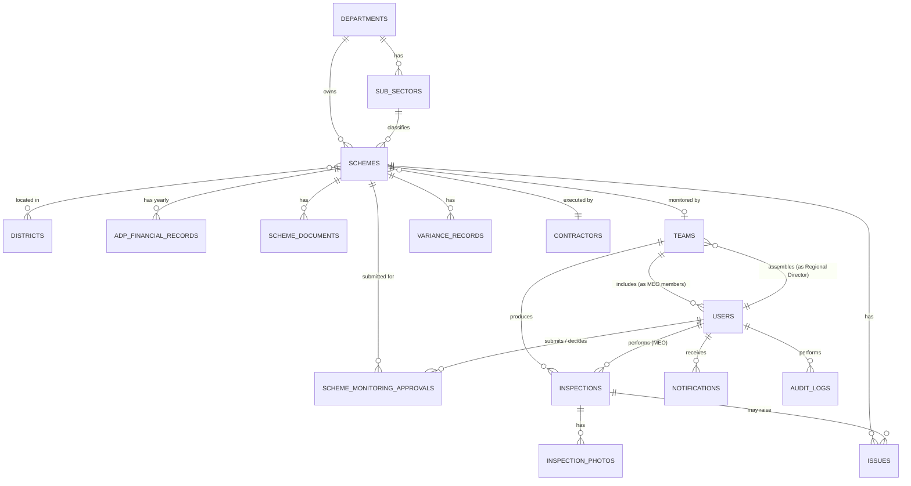

# MongoDB Database Schema — Smart Provincial M&E Management Ecosystem

**Stack:** MongoDB · Express.js · React Native · Node.js (MERN)
**ODM:** Mongoose (recommended)
**Source of truth for scheme data:** *Public Sector Development Programme (ADP) 2026-2027, Volume V* — Government of Sindh, P&D Department (1,856 pages, 45 departments, 3,715 schemes). Every field in Section 2.4-2.5 below is extracted directly from that document's scheme ledger, not invented.

---

## 0. What changed from the previous draft, and why

This revision replaces the earlier generic SIMS schema with one grounded in the actual government ADP book, plus your updated approval/execution workflow. Three structural changes:

1. **Real financial fields, not invented ones.** The ADP book tracks a scheme's finances as a rolling, fiscal-year time series (estimated cost, prior actual expenditure, revised allocation, throw-forward, next-year allocation - each split Capital/Revenue and with an FPA / Foreign Project Assistance component). This replaces the earlier generic `financialTransactions` collection with `adpFinancialRecords`, shaped exactly like the book's own columns.
2. **Department = Sector.** The book does not distinguish "department" from "sector" - there is one flat list of 45 departments (e.g. HEALTH, IRRIGATION), each broken into sub-sectors (e.g. Health has none further; Education splits into College Education, DEPD, School Education & Literacy, STEVTA, Universities and Boards). There is also no "Division" layer in the source data - only District(s), or "Sindh" for a province-wide scheme. The earlier sectors/departments/divisions split is retired in favor of departments -> subSectors -> schemes, and districts is now a many-to-many list per scheme.
3. **Two separate approval concepts, not one.** The ADP book's status (approved/unapproved, with a date) is the provincial government's PC-I/ADP approval of the scheme itself - a historical fact from the book, not something your app changes. Your new workflow - Regional Director submits the scheme for monitoring, Director General approves/rejects, then team assembly, then MEO inspection - is a separate, internal M&E approval lifecycle layered on top. These are modeled as two independent fields/collections so they're never confused: `schemes.adpApproval` (read from the book) vs. `schemeMonitoringApprovals` (your workflow, Section 3.2).

Role name change throughout: **FMO becomes MEO** (Monitoring & Evaluation Officer), and a new **Director General (DG)** role sits above Regional Director for monitoring-approval authority.

---

## 1. Collection List

| # | Collection | Origin | Purpose |
|---|-----------|--------|---------|
| 1 | departments | ADP book | The 45 government departments |
| 2 | subSectors | ADP book | Sub-sector breakdown within a department |
| 3 | districts | ADP book | Sindh districts referenced by scheme location |
| 4 | schemes | ADP book | The central scheme record, one per UID |
| 5 | adpFinancialRecords | ADP book | Yearly financial figures per scheme (time series, one per ADP edition) |
| 6 | contractors | Operational | Executing agencies / contractors |
| 7 | users | Operational | System users incl. new director_general and renamed meo roles |
| 8 | schemeMonitoringApprovals | New workflow | RD to DG submit/approve/reject history per scheme |
| 9 | teams | New workflow | Dynamic monitoring team assembled by an RD per scheme (1+ MEOs, RD optional member) |
| 10 | schemeDocuments | Operational | PC-I, technical sanction, drawings, revisions |
| 11 | inspections | Operational | MEO progress-report submissions (GPS, milestones, evidence) |
| 12 | inspectionPhotos | Operational | Watermarked evidence photographs |
| 13 | issues | Operational | Structured issue/observation reports |
| 14 | varianceRecords | Operational | Computed variance: ADP financial % vs. verified physical % |
| 15 | notifications | Operational | Notifications and alerts |
| 16 | auditLogs | Operational | Activity/audit trail |

### 1.1 Entity Relationship Overview



---

## 2. ADP-Sourced Collections

### 2.1 departments

**Purpose:** The 45 government departments from the ADP index (plus special block allocations). This is a flat list - the book uses "Sector" and "Department" interchangeably at this level.

| Field | Type | Required | Description |
|---|---|---|---|
| _id | ObjectId | auto | Primary key |
| name | String | yes | Exact department name, e.g. "AGRICULTURE, SUPPLY & PRICES", "HEALTH", "IRRIGATION" |
| adpSerialNo | Number | no | The book's own S.No for this department (1-45; changes rarely) |
| type | String enum | yes | department \| block_allocation - the book carries 5 special province-wide block allocations (e.g. Allocation for Divisional Headquarters, Special Initiatives for Backward Districts) alongside the 45 line departments |
| createdAt | Date | auto | - |

```js
const departmentSchema = new Schema({
  name: { type: String, required: true, unique: true },
  adpSerialNo: Number,
  type: { type: String, required: true, enum: ["department", "block_allocation"], default: "department" },
}, { timestamps: true });

departmentSchema.index({ name: 1 }, { unique: true });
```

**Indexes:** name (unique)

**Reference - the 45 departments as listed in the ADP index** (for seeding): Agriculture Supply & Prices; Auqaf, Religious Affairs, Zakat & Ushr; Board of Revenue; Culture, Tourism, Antiquities & Archives; Education Sector; Energy; Environment, Climate Change & Coastal Development; Excise, Taxation & Narcotics Control; Finance; Food; Forest & Wildlife; Governor's Secretariat; Health; Home; Human Rights; Human Settlement, Spatial Development & Social Housing; Industries & Commerce; Information; Irrigation; Labour & Human Resources; Law, P.A and Prosecution; Livestock & Fisheries; Local Government, Housing & Town Planning; Matching Allocations; Mega Projects for Karachi City; Mines & Mineral Development; Minorities Affairs; Planning & Development; Population Welfare; Provincial Assembly; Provincial Ombudsman; Public Health Engineering & Rural Development; Rehabilitation (PDMA); Science & Information Technology; Services, General Administration & Coordination; Sindh Public Service Commission; Sindh Revenue Board; Social Protection; Social Welfare; Sports & Youth Affairs; Thar Coal Infrastructure Development; Training, Management & Research; Transport and Mass Transit; Women Development; Works & Services.

---

### 2.2 subSectors

**Purpose:** Second-level grouping within a department (e.g. Agriculture splits into Agriculture Research, Agriculture Water Management, Agriculture Extension, Agriculture Marketing; Education splits into College Education, DEPD, School Education & Literacy, STEVTA, Universities and Boards). Every scheme in the book sits under exactly one sub-sector, and the book prints sub-sector subtotal rows.

| Field | Type | Required | Description |
|---|---|---|---|
| _id | ObjectId | auto | Primary key |
| departmentId | ObjectId (ref departments) | yes | Parent department |
| name | String | yes | e.g. "Agriculture Water Management" |
| createdAt | Date | auto | - |

```js
const subSectorSchema = new Schema({
  departmentId: { type: Schema.Types.ObjectId, ref: "Department", required: true },
  name: { type: String, required: true },
}, { timestamps: true });

subSectorSchema.index({ departmentId: 1, name: 1 }, { unique: true });
```

**Indexes:** compound { departmentId, name } (unique)

---

### 2.3 districts

**Purpose:** Sindh districts as they appear in the "Location of Scheme/District" column. A scheme may list one district, several, or the whole province.

| Field | Type | Required | Description |
|---|---|---|---|
| _id | ObjectId | auto | Primary key |
| name | String | yes | e.g. "Ghotki", "Shaheed Benazirabad", "Tando Muhammad Khan" |
| createdAt | Date | auto | - |

```js
const districtSchema = new Schema({
  name: { type: String, required: true, unique: true },
}, { timestamps: true });
```

**Indexes:** name (unique)

> Note: The book has no "Division" administrative layer - only District, or the literal value "Sindh" meaning province-wide. Model province-wide schemes with `schemes.provinceWide = true` and an empty `districtIds`, rather than inventing a fake "Sindh district".

---

### 2.4 schemes - Central Scheme Registry

**Purpose:** One document per scheme UID - the book's primary record. Fields map directly to the 19-column scheme ledger (Gen.Sr.No, UID, QR Code, Sector/Sub-sector/Name, Location/District, Status/Date of Approval, Target Completion, Estimated Cost - plus the financial columns which live in adpFinancialRecords, Section 2.5).

| Field | Type | Required | Description |
|---|---|---|---|
| _id | ObjectId | auto | Primary key |
| uid | String | yes | The book's unique scheme ID, e.g. "AGRAR-PP-25-0002" - unique across the whole ADP. Format convention: sub-sector-code - PP - YY - sequence |
| genSerialNo | Number | no | Current "Gen.Sr.No" in the latest ADP edition (changes edition to edition; historical values live on adpFinancialRecords) |
| name | String | yes | Full scheme name/description exactly as printed (can be long, often includes cost-sharing notes in parentheses) |
| departmentId | ObjectId (ref departments) | yes | - |
| subSectorId | ObjectId (ref subSectors) | yes | - |
| districtIds | Array of ObjectId (ref districts) | no | One or more districts; empty if provinceWide |
| provinceWide | Boolean | yes | true when location is printed as "Sindh" |
| adpApproval | Object | yes | { status, approvalDate, underRevision } - see below. This is the government's PC-I/ADP approval, read from the book, distinct from the internal monitoring approval in Section 3.2 |
| schemeCategory | String enum | yes | on_going \| unapproved_carried_forward - which subtotal section of the book the scheme is printed under |
| targetCompletionDate | Date | no | Parsed from the book's month-year label, e.g. "Jun-27" becomes 2027-06-01 |
| estimatedCost | Number | yes | Current total approved/estimated project cost, Rs. million (col. 8; latest value, history in adpFinancialRecords) |
| qrCodeUrl | String | no | Reserved for the ledger's QR Code column - present as a column heading in the book but not populated with data in the current edition; kept for forward compatibility |
| sourceEdition | Object | no | { adpVolume: "Volume V", fiscalYear: "2026-2027", pageFrom, pageTo } - provenance back to the printed book |
| physicalProgressPercent | Number | yes | Cached, weighted; recalculated on each MEO inspection (not from the ADP book, this is the M&E side) |
| varianceIndex / varianceClassification | Number / String enum | no | Cached latest variance - see Section 3.9 |
| milestones | Array of Object | no | Embedded weighted milestone list, defined by the M&E team once a scheme is approved for monitoring - not part of the ADP book |
| contractorId | ObjectId (ref contractors) | no | - |
| createdBy | ObjectId (ref users) | yes | - |
| createdAt / updatedAt | Date | auto | - |

**Embedded adpApproval sub-document:**

| Field | Type | Description |
|---|---|---|
| status | String enum | approved \| unapproved |
| approvalDate | Date | Null when status = unapproved |
| underRevision | Boolean | The book's "U/R" marker - the scheme's cost/scope was revised after initial approval |

**Embedded milestones[] sub-document:**

| Field | Type | Description |
|---|---|---|
| milestoneId | ObjectId | Unique ID within the array |
| name | String | e.g. "Earthwork", "Sub-base", "Structure" |
| weightPercent | Number | Contribution weight toward overall physical progress (weights total 100) |
| targetDate | Date | - |
| currentCompletionPercent | Number | Latest recorded completion (0-100) |
| lastUpdatedByInspectionId | ObjectId (ref inspections) | - |
| remarks | String | - |

```js
const milestoneSubSchema = new Schema({
  name: { type: String, required: true },
  weightPercent: { type: Number, required: true, min: 0, max: 100 },
  targetDate: Date,
  currentCompletionPercent: { type: Number, default: 0, min: 0, max: 100 },
  lastUpdatedByInspectionId: { type: Schema.Types.ObjectId, ref: "Inspection" },
  remarks: String,
}, { _id: true });

const schemeSchema = new Schema({
  uid: { type: String, required: true, unique: true },
  genSerialNo: Number,
  name: { type: String, required: true },
  departmentId: { type: Schema.Types.ObjectId, ref: "Department", required: true },
  subSectorId: { type: Schema.Types.ObjectId, ref: "SubSector", required: true },
  districtIds: [{ type: Schema.Types.ObjectId, ref: "District" }],
  provinceWide: { type: Boolean, default: false },
  adpApproval: {
    status: { type: String, required: true, enum: ["approved", "unapproved"] },
    approvalDate: Date,
    underRevision: { type: Boolean, default: false },
  },
  schemeCategory: {
    type: String,
    required: true,
    enum: ["on_going", "unapproved_carried_forward"],
  },
  targetCompletionDate: Date,
  estimatedCost: { type: Number, required: true },
  qrCodeUrl: String,
  sourceEdition: {
    adpVolume: String,
    fiscalYear: String,
    pageFrom: Number,
    pageTo: Number,
  },
  physicalProgressPercent: { type: Number, default: 0 },
  varianceIndex: Number,
  varianceClassification: { type: String, enum: ["normal", "yellow", "red"] },
  milestones: [milestoneSubSchema],
  contractorId: { type: Schema.Types.ObjectId, ref: "Contractor" },
  createdBy: { type: Schema.Types.ObjectId, ref: "User", required: true },
}, { timestamps: true });

schemeSchema.index({ uid: 1 }, { unique: true });
schemeSchema.index({ departmentId: 1, subSectorId: 1 });
schemeSchema.index({ districtIds: 1 });
schemeSchema.index({ "adpApproval.status": 1 });
schemeSchema.index({ varianceClassification: 1 });
```

**Indexes:** uid (unique) - compound { departmentId, subSectorId } - districtIds (multikey) - adpApproval.status - varianceClassification

---

### 2.5 adpFinancialRecords - Yearly Financial Ledger (time series)

**Purpose:** The book's financial columns (9 through 19) are inherently a rolling fiscal-year time series - every new ADP edition shifts the year labels forward by one. Rather than hardcoding "2025-2026" / "2026-2027" as field names (which would break next edition), each field is named for what it represents, and the actual fiscal year strings are stored as data. One document per scheme per ADP edition.

| Field | Type | Required | Description |
|---|---|---|---|
| _id | ObjectId | auto | Primary key |
| schemeId | ObjectId (ref schemes) | yes | - |
| adpFiscalYear | String | yes | The edition this record is from, e.g. "2026-2027" |
| genSerialNoThisEdition | Number | no | The Gen.Sr.No as printed in this edition (col. 1) |
| estimatedCost | Number | yes | Total estimated/approved cost as of this edition, Rs. million (col. 8) |
| priorActualExpenditure | Number | yes | Cumulative actual expenditure up to the end of the year before the allocation year, e.g. "upto June'25" (col. 9) |
| priorActualExpenditureAsOf | Date | no | e.g. 2025-06-30 |
| revisedAllocation | Object | yes | { total, fpa } for the outgoing/current fiscal year, e.g. 2025-2026 (cols. 10-11) |
| revisedAllocationFiscalYear | String | yes | e.g. "2025-2026" |
| estimatedExpenditureThroughAllocationYear | Number | yes | Estimated expenditure through June of the outgoing FY (col. 12) |
| throwForward | Number | yes | Unspent balance carried into the new fiscal year (col. 13) |
| throwForwardAsOf | Date | no | e.g. 2026-07-01 |
| nextYearAllocation | Object | yes | { capital, revenue, total, fpa } for the new fiscal year, e.g. 2026-2027 (cols. 14-17) |
| nextYearAllocationFiscalYear | String | yes | e.g. "2026-2027" |
| financialProgressPercent | Object | yes | { throughOutgoingFYJune, throughNextFYJune } - the book's two progress percentages (cols. 18-19) |
| createdAt | Date | auto | - |

```js
const adpFinancialRecordSchema = new Schema({
  schemeId: { type: Schema.Types.ObjectId, ref: "Scheme", required: true },
  adpFiscalYear: { type: String, required: true },
  genSerialNoThisEdition: Number,
  estimatedCost: { type: Number, required: true },
  priorActualExpenditure: { type: Number, required: true },
  priorActualExpenditureAsOf: Date,
  revisedAllocation: {
    total: { type: Number, required: true },
    fpa: { type: Number, default: 0 },
  },
  revisedAllocationFiscalYear: { type: String, required: true },
  estimatedExpenditureThroughAllocationYear: { type: Number, required: true },
  throwForward: { type: Number, required: true },
  throwForwardAsOf: Date,
  nextYearAllocation: {
    capital: { type: Number, required: true },
    revenue: { type: Number, required: true },
    total: { type: Number, required: true },
    fpa: { type: Number, default: 0 },
  },
  nextYearAllocationFiscalYear: { type: String, required: true },
  financialProgressPercent: {
    throughOutgoingFYJune: Number,
    throughNextFYJune: Number,
  },
}, { timestamps: true });

adpFinancialRecordSchema.index({ schemeId: 1, adpFiscalYear: 1 }, { unique: true });
```

**Indexes:** compound { schemeId, adpFiscalYear } (unique - one record per scheme per edition)

> Worked example, from the book itself (scheme AGRWM-PP-22-0012, Construction of Water Storage Reservoirs): estimatedCost 1,320.000; priorActualExpenditure 107.291; revisedAllocation { total: 250.000, fpa: 0 } for FY 2025-2026; estimatedExpenditureThroughAllocationYear 357.291; throwForward 962.709; nextYearAllocation { capital: 0, revenue: 284.141, total: 284.141, fpa: 0 } for FY 2026-2027; financialProgressPercent { throughOutgoingFYJune: 27.1, throughNextFYJune: 48.6 }.

---

## 3. Operational Collections (the M&E workflow)

### 3.1 users

| Field | Type | Required | Description |
|---|---|---|---|
| _id | ObjectId | auto | Primary key |
| name | String | yes | - |
| email | String | yes | Unique login email |
| passwordHash | String | yes | - |
| role | String enum | yes | pd_mec_central \| director_general \| line_department_head \| regional_director \| meo |
| departmentId | ObjectId (ref departments) | no | Applicable to line_department_head |
| region | String | no | Applicable to regional_director / meo - the book has no formal "division" layer, so region is a free-form label rather than a ref; more than one regional_director may share the same region |
| isActive | Boolean | yes | Default true |
| lastLoginAt | Date | no | - |
| createdAt / updatedAt | Date | auto | - |

```js
const userSchema = new Schema({
  name: { type: String, required: true },
  email: { type: String, required: true, unique: true, lowercase: true },
  passwordHash: { type: String, required: true },
  role: {
    type: String,
    required: true,
    enum: ["pd_mec_central", "director_general", "line_department_head", "regional_director", "meo"],
  },
  departmentId: { type: Schema.Types.ObjectId, ref: "Department" },
  region: String,
  isActive: { type: Boolean, default: true },
  lastLoginAt: Date,
}, { timestamps: true });

userSchema.index({ email: 1 }, { unique: true });
userSchema.index({ role: 1 });
```

**Indexes:** email (unique) - role

---

### 3.2 schemeMonitoringApprovals - Regional Director to Director General workflow

**Purpose:** This is the heart of the new flow. Every submit/reject/resubmit cycle for a scheme's monitoring is one document - a full audit trail of the approval loop, independent of the scheme's ADP/PC-I approval (Section 2.4).

Flow: Regional Director edits scheme (draft), then submits, status becomes pending, then Director General reviews - either rejected (with a required reason, and the Regional Director revises and resubmits, creating a new document that points back via revisionOf) or approved (the scheme is unlocked for team assembly).

| Field | Type | Required | Description |
|---|---|---|---|
| _id | ObjectId | auto | Primary key |
| schemeId | ObjectId (ref schemes) | yes | - |
| submittedBy | ObjectId (ref users) | yes | The Regional Director |
| submittedAt | Date | yes | - |
| decidedBy | ObjectId (ref users) | no | The Director General; null while pending |
| decidedAt | Date | no | - |
| status | String enum | yes | pending \| approved \| rejected |
| rejectionReason | String | no | Required when status = rejected |
| revisionOf | ObjectId (ref schemeMonitoringApprovals) | no | Points to the prior rejected cycle this submission revises, chaining the full history |
| snapshotAtSubmission | Object (Mixed) | no | Optional snapshot of the scheme's editable fields at submission time, for showing the DG exactly what changed since the last rejection |

```js
const schemeMonitoringApprovalSchema = new Schema({
  schemeId: { type: Schema.Types.ObjectId, ref: "Scheme", required: true },
  submittedBy: { type: Schema.Types.ObjectId, ref: "User", required: true },
  submittedAt: { type: Date, required: true, default: Date.now },
  decidedBy: { type: Schema.Types.ObjectId, ref: "User" },
  decidedAt: Date,
  status: { type: String, required: true, enum: ["pending", "approved", "rejected"], default: "pending" },
  rejectionReason: String,
  revisionOf: { type: Schema.Types.ObjectId, ref: "SchemeMonitoringApproval" },
  snapshotAtSubmission: Schema.Types.Mixed,
}, { timestamps: true });

schemeMonitoringApprovalSchema.index({ schemeId: 1, submittedAt: -1 });
schemeMonitoringApprovalSchema.index({ status: 1 });
```

**Indexes:** compound { schemeId, submittedAt: -1 } (approval history in order) - status (DG's pending-review queue)

**Derived scheme-level state:** rather than duplicating a status enum on schemes itself (which could drift out of sync), the application reads a scheme's current monitoring-approval state as the status of its most recent schemeMonitoringApprovals document for that scheme, sorted by submittedAt descending. A scheme is editable by its Regional Director only when that latest status is rejected or when no submission exists yet (still draft).

---

### 3.3 teams - Dynamic monitoring team per scheme

**Purpose:** Once a scheme is approved for monitoring, its Regional Director assembles a team: any number of MEOs, and optionally the Regional Director as a member. Fully dynamic - team size is not fixed, and a region can have multiple Regional Directors each running their own teams.

| Field | Type | Required | Description |
|---|---|---|---|
| _id | ObjectId | auto | Primary key |
| schemeId | ObjectId (ref schemes) | yes | One active team per scheme at a time (enforced via the partial unique index below) |
| assembledBy | ObjectId (ref users) | yes | The Regional Director who created this team |
| members | Array of Object | yes | See embedded sub-document below - one or more MEOs, and optionally the RD |
| status | String enum | yes | active \| disbanded - lets an RD reshuffle a team without losing history of who did what |
| createdAt / updatedAt | Date | auto | - |

**Embedded members[] sub-document:**

| Field | Type | Description |
|---|---|---|
| userId | ObjectId (ref users) | The MEO, or the Regional Director if they added themselves |
| roleInTeam | String enum | meo \| regional_director - the member's capacity on this team, independent of their system-wide role |
| addedAt | Date | - |
| removedAt | Date | Null while still an active member; set when reshuffled out without disbanding the whole team |

```js
const teamMemberSubSchema = new Schema({
  userId: { type: Schema.Types.ObjectId, ref: "User", required: true },
  roleInTeam: { type: String, required: true, enum: ["meo", "regional_director"] },
  addedAt: { type: Date, default: Date.now },
  removedAt: Date,
}, { _id: false });

const teamSchema = new Schema({
  schemeId: { type: Schema.Types.ObjectId, ref: "Scheme", required: true },
  assembledBy: { type: Schema.Types.ObjectId, ref: "User", required: true },
  members: { type: [teamMemberSubSchema], validate: v => v.length > 0 },
  status: { type: String, required: true, enum: ["active", "disbanded"], default: "active" },
}, { timestamps: true });

teamSchema.index({ schemeId: 1, status: 1 });
teamSchema.index({ "members.userId": 1 });
// Only one ACTIVE team per scheme - partial unique index
teamSchema.index(
  { schemeId: 1 },
  { unique: true, partialFilterExpression: { status: "active" } }
);
```

**Indexes:** compound { schemeId, status } - multikey members.userId (an MEO's "which teams am I on" query) - partial-unique { schemeId } where status is active (guarantees exactly one active team per scheme at a time)

**Inspection eligibility rule:** an MEO may only create an inspections document for a scheme if their userId appears in that scheme's active team's members[] with removedAt equal to null - enforced in the API layer, not just the UI.

---

### 3.4 contractors

| Field | Type | Required | Description |
|---|---|---|---|
| _id | ObjectId | auto | Primary key |
| name | String | yes | - |
| licenseNumber | String | no | - |
| contactPerson | String | no | - |
| phone | String | no | - |
| email | String | no | - |
| address | String | no | - |
| createdAt | Date | auto | - |

```js
const contractorSchema = new Schema({
  name: { type: String, required: true },
  licenseNumber: String,
  contactPerson: String,
  phone: String,
  email: String,
  address: String,
}, { timestamps: true });
```

---

### 3.5 schemeDocuments

| Field | Type | Required | Description |
|---|---|---|---|
| _id | ObjectId | auto | Primary key |
| schemeId | ObjectId (ref schemes) | yes | - |
| documentType | String enum | yes | pc1 \| administrative_approval \| technical_sanction \| engineering_drawing \| revised_timeline \| revision_request \| other |
| title | String | no | - |
| fileUrl | String | yes | Object storage URL/key |
| fileType | String | no | MIME type |
| version | Number | yes | Default 1 |
| uploadedBy | ObjectId (ref users) | yes | - |
| uploadedAt | Date | yes | - |

```js
const schemeDocumentSchema = new Schema({
  schemeId: { type: Schema.Types.ObjectId, ref: "Scheme", required: true },
  documentType: {
    type: String,
    required: true,
    enum: ["pc1", "administrative_approval", "technical_sanction",
           "engineering_drawing", "revised_timeline", "revision_request", "other"],
  },
  title: String,
  fileUrl: { type: String, required: true },
  fileType: String,
  version: { type: Number, default: 1 },
  uploadedBy: { type: Schema.Types.ObjectId, ref: "User", required: true },
  uploadedAt: { type: Date, default: Date.now },
}, { timestamps: true });

schemeDocumentSchema.index({ schemeId: 1, documentType: 1 });
```

**Indexes:** compound { schemeId, documentType }

---

### 3.6 inspections - MEO progress report

**Purpose:** Unchanged in substance from the original proposal (GPS/geofence verification, milestone progress, evidence, remarks) - only the actor is now an MEO acting as a member of a scheme's team, rather than a directly-assigned FMO.

| Field | Type | Required | Description |
|---|---|---|---|
| _id | ObjectId | auto | Primary key |
| schemeId | ObjectId (ref schemes) | yes | - |
| teamId | ObjectId (ref teams) | yes | The active team this inspection was conducted under |
| meoId | ObjectId (ref users) | yes | The MEO who conducted the inspection |
| inspectionDate | Date | yes | - |
| gpsAtInspection | GeoJSON Point | yes | { type: "Point", coordinates: [lng, lat] } |
| distanceFromSchemeMeters | Number | yes | - |
| geofencePassed | Boolean | yes | - |
| mockLocationSuspected | Boolean | yes | Default false |
| milestoneUpdates | Array of Object | no | Snapshot of milestone progress recorded this visit (milestoneId, milestoneName, weightPercent, completionPercent, remarks) |
| overallPhysicalProgressPercent | Number | yes | Weighted result computed at submission |
| observations / recommendations | String | no | - |
| resultingHealthClassification | String enum | no | satisfactory \| delayed \| halted_abandoned |
| submittedAt | Date | yes | - |
| syncedFromOffline | Boolean | yes | Default false |
| offlineCapturedAt | Date | no | - |

```js
const milestoneUpdateSubSchema = new Schema({
  milestoneId: { type: Schema.Types.ObjectId, required: true },
  milestoneName: String,
  weightPercent: Number,
  completionPercent: { type: Number, min: 0, max: 100, required: true },
  remarks: String,
}, { _id: false });

const inspectionSchema = new Schema({
  schemeId: { type: Schema.Types.ObjectId, ref: "Scheme", required: true },
  teamId: { type: Schema.Types.ObjectId, ref: "Team", required: true },
  meoId: { type: Schema.Types.ObjectId, ref: "User", required: true },
  inspectionDate: { type: Date, required: true },
  gpsAtInspection: {
    type: { type: String, enum: ["Point"], default: "Point" },
    coordinates: { type: [Number], required: true },
  },
  distanceFromSchemeMeters: { type: Number, required: true },
  geofencePassed: { type: Boolean, required: true },
  mockLocationSuspected: { type: Boolean, default: false },
  milestoneUpdates: [milestoneUpdateSubSchema],
  overallPhysicalProgressPercent: { type: Number, required: true },
  observations: String,
  recommendations: String,
  resultingHealthClassification: {
    type: String,
    enum: ["satisfactory", "delayed", "halted_abandoned"],
  },
  submittedAt: { type: Date, required: true },
  syncedFromOffline: { type: Boolean, default: false },
  offlineCapturedAt: Date,
}, { timestamps: true });

inspectionSchema.index({ schemeId: 1, inspectionDate: -1 });
inspectionSchema.index({ meoId: 1 });
inspectionSchema.index({ teamId: 1 });
inspectionSchema.index({ gpsAtInspection: "2dsphere" });
```

**Indexes:** compound { schemeId, inspectionDate: -1 } - meoId - teamId - gpsAtInspection (2dsphere)

---

### 3.7 inspectionPhotos

| Field | Type | Required | Description |
|---|---|---|---|
| _id | ObjectId | auto | Primary key |
| inspectionId | ObjectId (ref inspections) | yes | - |
| fileUrl | String | yes | - |
| thumbnailUrl | String | no | - |
| capturedAt | Date | yes | - |
| gps | GeoJSON Point | yes | - |
| watermarkData | Object | yes | { schemeUid, schemeName, latitude, longitude, timestamp, meoId } |
| checksumSha256 | String | yes | - |

```js
const inspectionPhotoSchema = new Schema({
  inspectionId: { type: Schema.Types.ObjectId, ref: "Inspection", required: true },
  fileUrl: { type: String, required: true },
  thumbnailUrl: String,
  capturedAt: { type: Date, required: true },
  gps: {
    type: { type: String, enum: ["Point"], default: "Point" },
    coordinates: { type: [Number], required: true },
  },
  watermarkData: {
    schemeUid: String,
    schemeName: String,
    latitude: Number,
    longitude: Number,
    timestamp: Date,
    meoId: String,
  },
  checksumSha256: { type: String, required: true },
}, { timestamps: true });

inspectionPhotoSchema.index({ inspectionId: 1 });
```

---

### 3.8 issues

| Field | Type | Required | Description |
|---|---|---|---|
| _id | ObjectId | auto | Primary key |
| schemeId | ObjectId (ref schemes) | yes | - |
| inspectionId | ObjectId (ref inspections) | no | Nullable |
| raisedBy | ObjectId (ref users) | yes | - |
| category | String enum | yes | contractor_delay \| funding_delay \| land_legal \| material_shortage \| quality_concern \| other |
| description | String | yes | - |
| severity | String enum | yes | low \| medium \| high \| critical |
| status | String enum | yes | open \| under_review \| resolved \| escalated |
| resolutionNotes | String | no | - |
| resolvedAt | Date | no | - |

```js
const issueSchema = new Schema({
  schemeId: { type: Schema.Types.ObjectId, ref: "Scheme", required: true },
  inspectionId: { type: Schema.Types.ObjectId, ref: "Inspection" },
  raisedBy: { type: Schema.Types.ObjectId, ref: "User", required: true },
  category: {
    type: String,
    required: true,
    enum: ["contractor_delay", "funding_delay", "land_legal", "material_shortage", "quality_concern", "other"],
  },
  description: { type: String, required: true },
  severity: { type: String, enum: ["low", "medium", "high", "critical"], default: "medium" },
  status: { type: String, enum: ["open", "under_review", "resolved", "escalated"], default: "open" },
  resolutionNotes: String,
  resolvedAt: Date,
}, { timestamps: true });

issueSchema.index({ schemeId: 1, status: 1 });
issueSchema.index({ severity: 1 });
```

---

### 3.9 varianceRecords

**Purpose:** Compares the ADP book's financial position for a scheme against verified physical progress from inspections. Financial % is read from the scheme's latest adpFinancialRecords document, not recomputed here.

| Field | Type | Required | Description |
|---|---|---|---|
| _id | ObjectId | auto | Primary key |
| schemeId | ObjectId (ref schemes) | yes | - |
| calculatedAt | Date | yes | - |
| sourceAdpFinancialRecordId | ObjectId (ref adpFinancialRecords) | yes | Which fiscal-year record the financial % was read from |
| financialExpenditurePercent | Number | yes | Derived, e.g. estimatedExpenditureThroughAllocationYear divided by estimatedCost times 100 |
| physicalProgressPercent | Number | yes | From the scheme's latest inspection |
| varianceIndex | Number | yes | financialExpenditurePercent minus physicalProgressPercent |
| classification | String enum | yes | normal \| yellow \| red |
| triggeredAlert | Boolean | yes | - |

```js
const varianceRecordSchema = new Schema({
  schemeId: { type: Schema.Types.ObjectId, ref: "Scheme", required: true },
  calculatedAt: { type: Date, required: true, default: Date.now },
  sourceAdpFinancialRecordId: { type: Schema.Types.ObjectId, ref: "AdpFinancialRecord", required: true },
  financialExpenditurePercent: { type: Number, required: true },
  physicalProgressPercent: { type: Number, required: true },
  varianceIndex: { type: Number, required: true },
  classification: { type: String, required: true, enum: ["normal", "yellow", "red"] },
  triggeredAlert: { type: Boolean, default: false },
}, { timestamps: true });

varianceRecordSchema.index({ schemeId: 1, calculatedAt: -1 });
varianceRecordSchema.index({ classification: 1 });
```

---

### 3.10 notifications

| Field | Type | Required | Description |
|---|---|---|---|
| _id | ObjectId | auto | Primary key |
| recipientId | ObjectId (ref users) | no | Nullable for role-broadcast |
| recipientRole | String enum | no | Same enum as users.role |
| type | String enum | yes | monitoring_submitted \| monitoring_approved \| monitoring_rejected \| team_member_added \| team_member_removed \| report_submitted \| project_delayed \| high_variance \| issue_escalated |
| schemeId | ObjectId (ref schemes) | no | - |
| title / message | String | yes | - |
| isRead | Boolean | yes | Default false |
| priority | String enum | yes | info \| warning \| critical |

```js
const notificationSchema = new Schema({
  recipientId: { type: Schema.Types.ObjectId, ref: "User" },
  recipientRole: {
    type: String,
    enum: ["pd_mec_central", "director_general", "line_department_head", "regional_director", "meo"],
  },
  type: {
    type: String,
    required: true,
    enum: ["monitoring_submitted", "monitoring_approved", "monitoring_rejected",
           "team_member_added", "team_member_removed", "report_submitted",
           "project_delayed", "high_variance", "issue_escalated"],
  },
  schemeId: { type: Schema.Types.ObjectId, ref: "Scheme" },
  title: { type: String, required: true },
  message: { type: String, required: true },
  isRead: { type: Boolean, default: false },
  priority: { type: String, enum: ["info", "warning", "critical"], default: "info" },
}, { timestamps: true });

notificationSchema.index({ recipientId: 1, isRead: 1, createdAt: -1 });
notificationSchema.index({ type: 1 });
```

---

### 3.11 auditLogs

| Field | Type | Required | Description |
|---|---|---|---|
| _id | ObjectId | auto | Primary key |
| userId | ObjectId (ref users) | yes | - |
| action | String | yes | e.g. scheme_submitted_for_monitoring, monitoring_approved, monitoring_rejected, team_assembled, team_member_added, inspection_submitted |
| entityType | String | yes | e.g. Scheme, SchemeMonitoringApproval, Team, Inspection |
| entityId | ObjectId | yes | - |
| changes | Object (Mixed) | no | Before/after snapshot or diff |
| ipAddress | String | no | - |
| timestamp | Date | yes | Default now |

```js
const auditLogSchema = new Schema({
  userId: { type: Schema.Types.ObjectId, ref: "User", required: true },
  action: { type: String, required: true },
  entityType: { type: String, required: true },
  entityId: { type: Schema.Types.ObjectId, required: true },
  changes: Schema.Types.Mixed,
  ipAddress: String,
  timestamp: { type: Date, default: Date.now },
});

auditLogSchema.index({ entityType: 1, entityId: 1 });
auditLogSchema.index({ userId: 1 });
auditLogSchema.index({ timestamp: -1 });
```

---

## 4. Complete Workflow, Mapped to Collections

```
1. Regional Director creates/edits a Scheme                 -> schemes (draft; no schemeMonitoringApprovals doc yet)
2. Regional Director submits for monitoring approval        -> schemeMonitoringApprovals { status: "pending" }
                                                                 + notifications -> director_general
3. Director General reviews
     - Rejects                                               -> schemeMonitoringApprovals { status: "rejected", rejectionReason }
                                                                 + notifications -> regional_director
       Regional Director revises the Scheme, resubmits       -> new schemeMonitoringApprovals { revisionOf: <previous> }
       (loop back to step 3)
     - Approves                                               -> schemeMonitoringApprovals { status: "approved" }
                                                                 + notifications -> regional_director
4. Regional Director assembles a Team (1+ MEOs,
   optionally self)                                           -> teams { status: "active", members: [...] }
                                                                 + notifications -> each added MEO
5. An MEO on the active team visits the site and
   submits a progress report (GPS verify, camera,
   milestones, remarks/issues, submit)                        -> inspections, inspectionPhotos, issues
                                                                 + scheme.milestones / physicalProgressPercent updated
6. Variance Engine compares latest adpFinancialRecords
   against latest inspection's physical progress               -> varianceRecords
                                                                 + notifications (if red flag) -> pd_mec_central, dept head
```

---

## 5. Design Decisions

**Real data first.** departments, subSectors, districts, schemes, and adpFinancialRecords are modeled to mirror the ADP book's own columns exactly, so the initial data load can be a near-literal import of the 3,715-scheme ledger with no field remapping guesswork.

**Two approvals, two collections, never merged.** schemes.adpApproval (government PC-I approval, historical/read-mostly) and schemeMonitoringApprovals (your RD-to-DG monitoring workflow, active/write-heavy) are kept fully separate - merging them would make it impossible to tell "the government approved this scheme's budget in 2023" apart from "the DG approved this scheme for monitoring last week."

**Approval status is derived, not duplicated.** Rather than a monitoringStatus field on schemes that could drift out of sync with its approval history, the current state is always read as the latest schemeMonitoringApprovals document for that scheme (queried by schemeId, sorted by submittedAt descending). This makes the approval history the single source of truth.

**Teams are dynamic and reshuffleable.** teams.members[] is an array (not a fixed 1:1 assignment) precisely because a team may have one or many MEOs, and status active/disbanded plus per-member removedAt lets a Regional Director change team composition mid-scheme without losing the record of who did what and when. The partial-unique index on schemeId (only for status active) guarantees a scheme never has two active teams at once, while still allowing full history of past disbanded teams.

**Financial data is a time series, not a snapshot.** adpFinancialRecords stores one document per scheme per ADP edition rather than overwriting fields on schemes each year - this preserves every past year's allocation/expenditure figures exactly as published, which is essential for an official government financial record and for computing multi-year variance trends.

**Embedding vs. referencing** follows the same rule as before: schemes.milestones[] and inspections.milestoneUpdates[] are embedded (small, bounded, or a point-in-time snapshot); everything that grows unboundedly over a scheme's life (documents, financial records, inspections, photos, issues, approvals, notifications, audit logs) is a separate referenced collection.

**Geospatial support** is unchanged: inspections.gpsAtInspection carries a 2dsphere index for geofence-distance queries. (schemes itself does not carry a single GPS point in the ADP book - district-level location only - so a dedicated scheme coordinate/boundary would need to be captured separately by the M&E team if a precise GIS pin is required; flag this if the map feature needs it, since it isn't in the source data.)

---

## 6. Suggested Indexes for Common Queries

| Query Pattern | Recommended Index |
|---|---|
| Look up a scheme by its official UID | schemes: { uid } (unique) |
| Browse schemes by department/sub-sector | schemes: { departmentId, subSectorId } |
| Filter schemes by district | schemes: { districtIds } (multikey) |
| DG's pending-approval queue | schemeMonitoringApprovals: { status } |
| A scheme's full approval history | schemeMonitoringApprovals: { schemeId, submittedAt: -1 } |
| Which schemes is this MEO on a team for | teams: { members.userId } |
| A scheme's current active team | teams: { schemeId, status } (plus partial unique) |
| A scheme's financial history across editions | adpFinancialRecords: { schemeId, adpFiscalYear } (unique) |
| Red-flag / high-variance scheme list | schemes: { varianceClassification }, varianceRecords: { classification } |
| Notification inbox | notifications: { recipientId, isRead, createdAt: -1 } |
