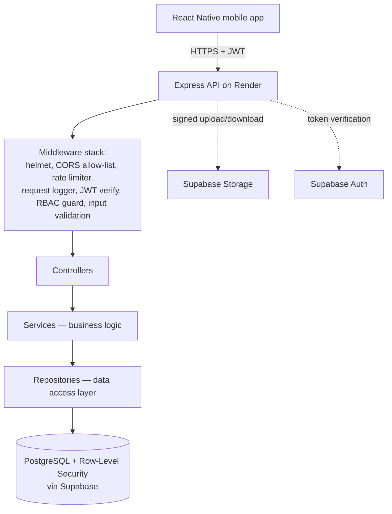
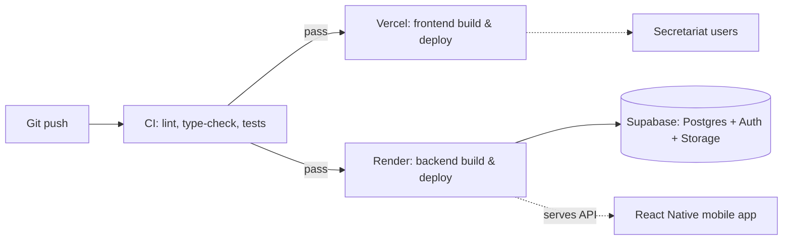

# Architecture & Tech Stack

## Smart Provincial M&E Management Ecosystem

This document defines the technical architecture, tech stack, and — deliberately in depth — the backend hardening strategy for security, performance, and efficiency. It complements `PRD.md` (product), `schema.md` (data model), and `phases.md` (build order); this file answers *how the system is built and defended*, not what it does or when.

---

## 1. Tech stack summary

| Layer | Technology | Why |
|---|---|---|
| Mobile client | React Native | Single codebase for the field-facing app used by RD/DG/MEO/support roles |
| Backend API | Node.js + Express.js | Matches team's existing JS/TS skill set (PERN), mature middleware ecosystem for the security work in §3 |
| Database | PostgreSQL via Supabase | Relational integrity for the ADP scheme data + operational workflow (see `schema.md`); Supabase adds managed Auth, Storage, and Row-Level Security on top of raw Postgres |
| Auth | Supabase Auth (JWT-based) | Avoids hand-rolling session/password management; issues short-lived JWTs the API and Postgres RLS both verify |
| File storage | Supabase Storage | Site-visit photos, issue-report photos; private buckets with signed URLs |
| Frontend hosting | Vercel | CI-integrated deploys; used for any web-based surface (see open question in `PRD.md` §12 on admin dashboard vs. RN-Web) |
| Backend hosting | Render | Managed Node hosting with auto-deploy from Git, health checks, horizontal scaling |

---

## 2. High-level architecture



**Why an API layer sits in front of Supabase at all**, rather than letting the mobile app talk to Supabase directly: business rules that don't belong in the database (e.g. "a team must have exactly one lead MEO before it can be submitted," "a rejected team's version must increment," notification fan-out, future digest-report generation) need a place to live that isn't SQL and isn't the mobile client. The API is also the single point where rate limiting, request validation, and audit logging are enforced consistently — relying on the client to behave is not a security boundary.

## 3. Backend layered architecture

```
routes/          → maps HTTP verbs + paths to controllers, nothing else
controllers/      → parses/validates the request, calls a service, shapes the response
services/         → business logic (e.g. "approve a team", "file an issue"), no HTTP or SQL specifics
repositories/     → the only layer that talks to Supabase/Postgres directly
middleware/       → auth, RBAC, validation, rate limiting, logging, error handling
```

This separation matters for the "strong backend" goal specifically:
- **Security**: authorization checks live in one place (middleware + service layer), not scattered across route handlers where one might get missed.
- **Testability**: services can be unit-tested without spinning up HTTP or a database.
- **Performance**: repositories are the only place queries are written, making it straightforward to audit for N+1 patterns or missing indexes in one pass instead of hunting across the codebase.

---

## 4. Security architecture

Security is treated as **defense in depth** — every control below assumes at least one other layer could fail, so no single control is load-bearing on its own.

### 4.1 Authentication
- Supabase Auth issues short-lived JWTs (access token) plus a refresh token; the mobile app never stores a long-lived credential.
- Every API request carries the JWT in the `Authorization` header; a middleware verifies it against Supabase's public key **before any route handler runs**.
- Refresh tokens are stored in secure device storage (e.g. `expo-secure-store`/Keychain/Keystore), never in plain AsyncStorage.

### 4.2 Authorization — enforced twice, deliberately
1. **Application layer (RBAC middleware)**: every route declares which role(s) may call it; a support user hitting a write endpoint is rejected before touching the database.
2. **Database layer (Postgres Row-Level Security)**: even if an application-layer check were ever missed, RLS policies on `visit_forms`, `visit_photos`, `issue_reports`, `comments`, and the division-scoped tables independently enforce the same rules at the SQL level (see `schema.md` §5 for the exact join conditions per role).

This double enforcement is the single most important security decision in this architecture — a bug in the Express layer cannot become a data breach, because Postgres itself refuses the query.

### 4.3 Input validation
- Every request body, query param, and route param is validated against an explicit schema (e.g. `zod` or `joi`) **before** it reaches a controller's business logic — reject unknown fields, wrong types, and out-of-range values at the door.
- Validation failures return a generic `400` with a field-level error list; they never echo back raw user input unescaped.

### 4.4 File upload security (visit photos, issue photos)
- Uploads go through the API (or via Supabase Storage signed upload URLs the API issues), never a raw client-side write to a public bucket.
- Enforce: allow-listed MIME types (images only), a max file size, and re-encoding/stripping EXIF metadata server-side before storage (photos may otherwise leak device GPS data beyond the intentional `geo_lat`/`geo_lng` fields).
- Storage buckets are **private**; access is via short-lived signed URLs scoped to a user who's actually allowed to view that visit's photos (same RLS join logic as §4.2).

### 4.5 Transport & infrastructure security
- HTTPS-only everywhere (Render and Vercel both provide this by default) — the API should reject/redirect any plain HTTP.
- `helmet` middleware sets standard security headers (HSTS, no-sniff, frame-ancestors, etc.).
- CORS is an explicit allow-list of known origins (the deployed frontend and nothing else) — never a wildcard `*` in production.

### 4.6 Secrets management
- `SUPABASE_SERVICE_ROLE_KEY` (the privileged key that bypasses RLS) lives **only** on the backend, never in the mobile bundle or any client-side env var.
- All secrets come from the hosting platform's environment variable store (Render/Vercel), never committed to Git — `.env` stays in `.gitignore` from the first commit.
- Rotate keys on any suspected exposure; don't wait for a scheduled rotation policy to be the only trigger.

### 4.7 Rate limiting & abuse prevention
- Per-IP and per-authenticated-user rate limits (e.g. `express-rate-limit`) on all endpoints, tighter on auth-related and write endpoints than on read endpoints.
- Login/token-refresh endpoints get stricter limits to blunt credential-stuffing attempts, even though Supabase Auth itself has some baseline protection.

### 4.8 Audit logging
- `team_approval_requests` is already append-only by design (`schema.md` §4.2) — every submit/reject/resubmit is a permanent row, never an overwrite.
- Extend the same append-only pattern to a general-purpose `audit_log` table (actor, action, entity type/id, timestamp, metadata) for anything security-sensitive that isn't already covered by a domain table — role changes, failed auth attempts, deletions.
- Logs are written server-side only; the client cannot forge an audit entry.

### 4.9 Dependency & vulnerability management
- `npm audit` (or equivalent) run in CI on every PR; block merges on high/critical findings.
- Automated dependency update tooling (Dependabot or similar) so patches don't sit unapplied for months.

### 4.10 Error handling hygiene
- A single centralized error-handling middleware formats all errors consistently and **never** leaks stack traces, SQL error text, or internal file paths to the client — those go to server-side logs only.
- Distinguish "expected" errors (validation failure, not found, forbidden) from "unexpected" ones (crash-worthy bugs) so client-facing messages stay generic for the latter.

---

## 5. Performance architecture

### 5.1 Database performance
- Every index recommended in `schema.md` §7 is applied from the first migration, not added reactively after slow-query complaints — with ~3,700+ schemes and growing visit/photo/issue volume, missing an index on a foreign key used in a division-scope filter is the most likely first performance bug.
- Connection pooling via Supabase's pooler (PgBouncer) rather than one raw connection per request — Express is stateless and can scale horizontally, so unpooled connections would exhaust Postgres's connection limit quickly.
- Pagination (cursor-based, not offset-based, once lists get large) on every list endpoint — the scheme browser and dashboards must never attempt to return an unbounded result set.

### 5.2 Caching strategy
- Reference data that changes rarely — `divisions`, `districts`, `departments`, `sub_sectors`, `form_templates` — is a strong candidate for a short-TTL in-memory or Redis cache in front of the repository layer, since it's read constantly (every scheme browse, every form render) but written almost never.
- Cache invalidation is explicit: an admin action that updates a `form_template` busts that template's cache key, not a blanket flush.
- Scheme data itself (`schemes`, progress rollups) is read far more often than written, but changes often enough (new visits update `physical_progress_pct`) that caching it needs a shorter TTL or event-based invalidation rather than a long static cache.

### 5.3 Efficient I/O patterns
- All database calls in the API are async/non-blocking — nothing should synchronously block Node's event loop, since one slow request must not stall every other concurrent request.
- Repositories fetch related data via proper joins (e.g. a scheme with its district/division in one query) rather than looping and issuing N+1 queries per row.

### 5.4 Media handling
- Photos are compressed/resized client-side before upload (React Native image manipulation) to cut upload time and storage/bandwidth cost, especially important for MEOs on weak rural connectivity.
- Supabase Storage serves images via CDN — no need to proxy image bytes through the Express API on read.

### 5.5 Background work, not request-blocking work
- Anything that isn't needed to answer the current request synchronously — notification fan-out, future digest-report generation (Phase 4), the ADP booklet re-import — runs as a background job (a queue/worker pattern, or at minimum a fire-and-forget task with its own error handling), not inline in the request/response cycle. A DG approving a team should get an instant response; the notification to the team members can happen a beat later.

### 5.6 Horizontal scalability
- The API is kept stateless (no in-memory session state) so Render can scale it to multiple instances behind a load balancer without sticky sessions.
- Any caching layer that needs to be shared across instances (§5.2) uses Redis rather than per-instance in-memory state, once traffic justifies it — a single-instance in-memory cache is fine to start with and easy to promote later.

---

## 6. Reliability, observability & efficiency

- **Structured logging** (JSON logs with request id, user id, route, latency) rather than free-text `console.log`, so logs are queryable once volume grows.
- **Error tracking** (e.g. Sentry) captures unexpected exceptions with stack traces server-side, separate from the sanitized client-facing error responses in §4.10.
- **Health check endpoint** (`/health`) that Render can poll, checking at minimum that the process is up and the database connection is alive — used for both uptime monitoring and safe rolling deploys.
- **CI/CD**: every PR runs lint, type-check, and tests; only a passing build auto-deploys to Render/Vercel. No manual "just push and see" deploys to production.
- **Testing strategy**: unit tests on services (business logic, framework-free), integration tests on API routes (hitting a real or test Postgres instance), and at least smoke tests confirming RLS policies actually block what they're supposed to — an RLS policy with no test is a policy nobody has verified works.
- **Environment separation**: distinct Supabase projects (or at minimum distinct schemas/credentials) for development, staging, and production — never develop against production data.
- **API versioning**: prefix routes (`/api/v1/...`) from day one, so a breaking change later doesn't require a simultaneous mobile-app + backend release.

---

## 7. Deployment architecture



Supabase itself is managed infrastructure — backups, connection pooling, and Postgres patching are handled by Supabase rather than self-managed, which reduces the operational surface this team needs to own directly.

---

## 8. Baseline performance targets

These are starting design targets, not yet measured — revisit once real usage data exists:

| Metric | Target |
|---|---|
| API p95 latency (read endpoints) | < 300ms |
| API p95 latency (write endpoints, e.g. form submit) | < 800ms |
| Scheme browser list load (first page) | < 2s on average mobile connectivity |
| Photo upload (compressed, per image) | < 5s on 3G-equivalent connectivity |
| Concurrent users supported at MVP scale | Low hundreds across 6 divisions, without degradation |

---

## 9. Backend hardening checklist

A punch list to work through explicitly during Phase 0/1 build-out (see `phases.md`), grouped by the three properties requested:

**Security**
- [ ] JWT verification middleware on every non-public route
- [ ] RBAC middleware per route, matching the permission matrix in `PRD.md` §7
- [ ] RLS policies on every division/team-scoped table, tested independently of the API
- [ ] Input validation schema on every endpoint
- [ ] Private storage buckets + signed URLs for all photos
- [ ] `helmet` + explicit CORS allow-list
- [ ] Secrets only in platform env vars, never committed
- [ ] Rate limiting on all endpoints, stricter on auth/write
- [ ] Centralized error handler that never leaks internals
- [ ] `npm audit` (or equivalent) gating CI

**Performance**
- [ ] All indexes from `schema.md` §7 applied in the initial migration
- [ ] Connection pooling configured (Supabase pooler)
- [ ] Pagination on every list endpoint
- [ ] Cache layer for static reference data
- [ ] Client-side photo compression before upload
- [ ] No synchronous/blocking calls in request handlers

**Efficiency**
- [ ] Layered architecture (routes/controllers/services/repositories) followed consistently, no logic in route handlers
- [ ] Structured logging + error tracking wired up before first deploy
- [ ] Health check endpoint + CI/CD gating deploys
- [ ] Background job pattern in place before Phase 2 notifications are built
- [ ] API versioned from the first route

---

## 10. Companion documents

- `PRD.md` — product requirements this architecture serves
- `schema.md` — full data model, including the exact RLS join logic referenced in §4.2
- `app-operational-schema.sql` — executable DDL
- `phases.md` — when each piece of this architecture actually gets built
- `README.md` — project overview and getting-started scaffold
- `Memory.md` — current implementation status
