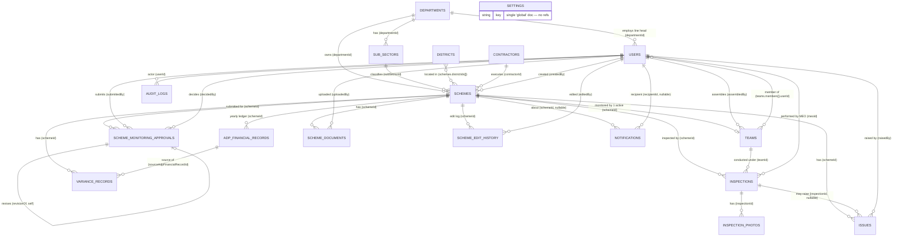

# Database schema — entities, attributes & relationships

MongoDB (Mongoose). 18 collections. Every relationship below is an `ObjectId`
reference (Mongoose `ref`) unless marked **embedded**.

---

## Where is the `sectors` collection?

**There is no `sectors` collection.** It was removed.

The ADP book (the source of truth) uses "Sector" and "Department" as the **same
level** — one flat list of 45 departments (`HEALTH`, `IRRIGATION`, …). So:

| Old design (retired) | Now |
|---|---|
| `sectors` | folded into **`departments`** (department *is* the sector) |
| `departments` (child of sector) | **`departments`** (flat, top level) |
| `divisions` | removed — the book has no division layer, only District or "Sindh" |

The second level of grouping is **`subSectors`** (e.g. *Agriculture Water
Management* under *Agriculture*). The old empty `sectors` and `divisions`
collections were dropped from the database during the ADP import.

Retired Mongoose models: `Sector`, `Division`, `InspectionAssignment`,
`Milestone` (standalone), `FinancialTransaction`.

---

## Entity–relationship diagram

---

## Foreign-key reference (every cross-collection link)

| From collection | Attribute | → To collection | Card. | Notes |
|---|---|---|---|---|
| **subSectors** | `departmentId` | departments | N:1 | required; unique `{departmentId, name}` |
| **schemes** | `departmentId` | departments | N:1 | required |
| **schemes** | `subSectorId` | subSectors | N:1 | required |
| **schemes** | `districtIds[]` | districts | N:M | array; empty when `provinceWide: true` |
| **schemes** | `contractorId` | contractors | N:1 | optional |
| **schemes** | `createdBy` | users | N:1 | required |
| **schemes** | `milestones[].lastUpdatedByInspectionId` | inspections | N:1 | **embedded** sub-doc field |
| **adpFinancialRecords** | `schemeId` | schemes | N:1 | required; unique `{schemeId, adpFiscalYear}` (time series) |
| **users** | `departmentId` | departments | N:1 | only for role `line_department_head` |
| **schemeMonitoringApprovals** | `schemeId` | schemes | N:1 | required |
| **schemeMonitoringApprovals** | `submittedBy` | users | N:1 | the Regional Director |
| **schemeMonitoringApprovals** | `decidedBy` | users | N:1 | the Director General; null while pending |
| **schemeMonitoringApprovals** | `revisionOf` | schemeMonitoringApprovals | N:1 | **self-reference** — prior rejected cycle |
| **teams** | `schemeId` | schemes | N:1 | required; partial-unique `{schemeId}` where `status:"active"` |
| **teams** | `assembledBy` | users | N:1 | the Regional Director |
| **teams** | `members[].userId` | users | N:M | **embedded** array; `removedAt` set instead of deleting |
| **schemeDocuments** | `schemeId` | schemes | N:1 | required |
| **schemeDocuments** | `uploadedBy` | users | N:1 | required |
| **inspections** | `schemeId` | schemes | N:1 | required |
| **inspections** | `teamId` | teams | N:1 | the active team it was conducted under |
| **inspections** | `meoId` | users | N:1 | the MEO who performed it |
| **inspections** | `milestoneUpdates[].milestoneId` | schemes.`milestones[]._id` | N:1 | **embedded→embedded**, not a collection |
| **inspectionPhotos** | `inspectionId` | inspections | N:1 | required |
| **issues** | `schemeId` | schemes | N:1 | required |
| **issues** | `inspectionId` | inspections | N:1 | nullable |
| **issues** | `raisedBy` | users | N:1 | required |
| **varianceRecords** | `schemeId` | schemes | N:1 | required |
| **varianceRecords** | `sourceAdpFinancialRecordId` | adpFinancialRecords | N:1 | which fiscal-year row the financial % came from |
| **notifications** | `recipientId` | users | N:1 | nullable (role-broadcast uses `recipientRole` enum instead) |
| **notifications** | `schemeId` | schemes | N:1 | nullable |
| **schemeEditHistory** | `schemeId` | schemes | N:1 | required |
| **schemeEditHistory** | `editedBy` | users | N:1 | required |
| **auditLogs** | `userId` | users | N:1 | required |
| **auditLogs** | `entityId` | *(polymorphic)* | — | plain ObjectId + `entityType` string; not a hard `ref` |

Collections with **no outgoing references**: `departments`, `districts`,
`contractors`, `settings`.

---

## Attributes per collection (key fields)

### departments
`_id` · `name` (unique) · `adpSerialNo` · `type` (`department` \| `block_allocation`)

### subSectors
`_id` · **`departmentId`** · `name`

### districts
`_id` · `name` (unique)

### contractors
`_id` · `name` · `licenseNumber` · `contactPerson` · `phone` · `email` · `address`

### users
`_id` · `name` · `email` (unique) · `passwordHash` · `role`
(`pd_mec_central` \| `director_general` \| `line_department_head` \|
`regional_director` \| `meo`) · **`departmentId`** · `region` (free-text) ·
`isActive` · `lastLoginAt`

### schemes
`_id` · `uid` (unique, ADP format) · `genSerialNo` · `name` ·
**`departmentId`** · **`subSectorId`** · **`districtIds[]`** · `provinceWide` ·
`adpApproval` `{ status(approved|unapproved), approvalDate, underRevision }` ·
`schemeCategory` (`on_going` \| `unapproved_carried_forward`) ·
`targetCompletionDate` · `estimatedCost` · `qrCodeUrl` ·
`sourceEdition { adpVolume, fiscalYear, pageFrom, pageTo }` ·
`location` (GeoJSON Point, optional) · `physicalProgressPercent` ·
`varianceIndex` · `varianceClassification` (`normal|yellow|red`) ·
**`contractorId`** · **`createdBy`** ·
`milestones[]` **embedded** `{ _id, name, weightPercent, targetDate,
currentCompletionPercent, lastUpdatedByInspectionId→inspections, remarks }`

### adpFinancialRecords  (one per scheme per ADP edition — never overwritten)
`_id` · **`schemeId`** · `adpFiscalYear` · `genSerialNoThisEdition` ·
`estimatedCost` · `priorActualExpenditure` (+`AsOf`) ·
`revisedAllocation { total, fpa }` · `revisedAllocationFiscalYear` ·
`estimatedExpenditureThroughAllocationYear` · `throwForward` (+`AsOf`) ·
`nextYearAllocation { capital, revenue, total, fpa }` ·
`nextYearAllocationFiscalYear` ·
`financialProgressPercent { throughOutgoingFYJune, throughNextFYJune }`

### schemeMonitoringApprovals  (internal RD→DG workflow; current state = latest doc by `submittedAt`)
`_id` · **`schemeId`** · **`submittedBy`** · `submittedAt` · **`decidedBy`** ·
`decidedAt` · `status` (`pending|approved|rejected`) · `rejectionReason`
(required when rejected) · **`revisionOf`** (self) · `snapshotAtSubmission`

### teams  (exactly one `active` per scheme)
`_id` · **`schemeId`** · **`assembledBy`** · `status` (`active|disbanded`) ·
`members[]` **embedded** `{ userId→users, roleInTeam(meo|regional_director),
addedAt, removedAt }`

### schemeDocuments
`_id` · **`schemeId`** · `documentType` · `title` · `fileUrl` · `fileType` ·
`version` · **`uploadedBy`** · `uploadedAt`

### inspections
`_id` · **`schemeId`** · **`teamId`** · **`meoId`** · `inspectionDate` ·
`gpsAtInspection` (GeoJSON Point) · `distanceFromSchemeMeters` ·
`geofencePassed` · `mockLocationSuspected` ·
`milestoneUpdates[]` **embedded** `{ milestoneId, milestoneName, weightPercent,
completionPercent, remarks }` · `overallPhysicalProgressPercent` ·
`observations` · `recommendations` · `resultingHealthClassification`
(`satisfactory|delayed|halted_abandoned`) · `submittedAt` · `syncedFromOffline`

### inspectionPhotos
`_id` · **`inspectionId`** · `fileUrl` · `thumbnailUrl` · `capturedAt` · `gps` ·
`watermarkData { schemeUid, schemeName, latitude, longitude, timestamp, meoId }`
· `checksumSha256`

### issues
`_id` · **`schemeId`** · **`inspectionId`** (nullable) · **`raisedBy`** ·
`category` · `description` · `severity` (`low|medium|high|critical`) ·
`status` (`open|under_review|resolved|escalated`) · `resolutionNotes` · `resolvedAt`

### varianceRecords
`_id` · **`schemeId`** · `calculatedAt` · **`sourceAdpFinancialRecordId`** ·
`financialExpenditurePercent` · `physicalProgressPercent` · `varianceIndex` ·
`classification` (`normal|yellow|red`) · `triggeredAlert`

### notifications
`_id` · **`recipientId`** (nullable) · `recipientRole` (enum, broadcast) ·
`type` · **`schemeId`** (nullable) · `title` · `message` · `isRead` ·
`priority` (`info|warning|critical`)

### auditLogs
`_id` · **`userId`** · `action` · `entityType` (string) · `entityId` (ObjectId,
polymorphic) · `changes` (Mixed) · `ipAddress` · `timestamp`

### schemeEditHistory
`_id` · **`schemeId`** · **`editedBy`** · `changes` `{ field: { from, to } }`

### settings  (single `global` doc)
`_id` · `key` · `geofenceRadiusMeters` · `varianceYellowThreshold` ·
`varianceRedThreshold`
